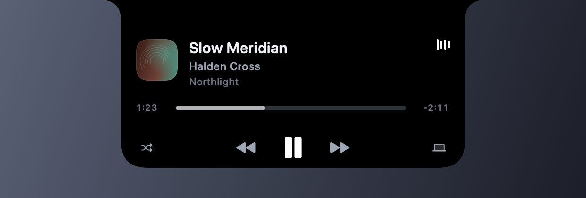

# Aperture

A quiet status hub for the top of your display.

Aperture turns the top-centre strip of a Mac screen into a small, restrained
overlay: a black slab that appears to grow out of the camera housing, widens
into a live-activity strip when something is happening, and springs open into a
compact hub when you ask it to.

The seamlessness is deliberate and is the fiddliest part of the design. The slab
is filled pure black rather than the palette's graphite, because the housing is
an absence of pixels and anything even fractionally lighter draws a visible
rectangle exactly where the notch is. It carries no border and no top highlight,
because any stroke crossing the top edge becomes a seam. Its top corners are
square and overshoot the screen — a rounded top corner leaves a sliver of
desktop and makes the overlay look like it is dangling — while the bottom
corners are rounded and the top corners flare outward with a concave fillet, so
the slab reads as one moulded shape rather than a rectangle butted against an
edge. In the collapsed state it is exactly as tall as the housing and only a
little wider, so it looks like the notch itself, and hovering grows it sideways
only. On a Mac with no housing the same silhouette merges with the bezel.

Playback chrome — transport, meters, timelines, the level indicator — is
monochrome: white on black. The accent is reserved for state signals (which pane
you are on, shuffle latched on, a focus ring, an event about to start), and ships
as **Mono**, so the overlay is colourless out of the box and album artwork is the
only colour in it. Violet, azure, teal, amber and rose remain in Settings ▸
Appearance for anyone who wants the state signals tinted.

Contrast and depth live *inside* the slab — wells, cards, the accent — where
they cannot give the outline away. Turning on Increase Contrast adds an outline
that traces the visible silhouette only, never across the top edge.

Original design, original code, no third-party dependencies. One private
framework, deliberately chosen: DisplayServices, for built-in display
brightness only (see limitation 3).

---

## Screenshots

Rendered from the app's own views with placeholder data, on a plain background
with the camera housing drawn in black — so the seam between slab and housing is
the real thing, not a mock-up. `./Scripts/screenshots.sh` regenerates them, and
does so identically every run, so a UI change shows up as a clean diff.

**Resting.** Exactly as tall as the housing and only a little wider, so it reads
as the notch itself. Artwork on one side, a playback pulse on the other.


**Live activity.** Widens into a strip when something is playing.


**The hub.** Springs open on click, shortcut or menu — transport, timeline and
output device.



**Volume and brightness.** The readout that replaces macOS's own panel: the name
on one side of the housing, the level on the other.


---

## Install

No notarised build is distributed, so build it yourself. Requires Xcode (see
*Requirements*).

```bash
git clone https://github.com/maanasmandaliya/aperture-macos.git
```

```bash
cd aperture-macos && ./Scripts/build.sh release
```

```bash
cp -R .build/Aperture.app /Applications/ && open /Applications/Aperture.app
```

Aperture has no Dock icon — look for the dotted-circle glyph in the menu bar.
The Xcode project sets no development team, so Xcode signs with yours
automatically; the scripts pick up any codesigning identity on the machine and
sign ad-hoc if there is none.

Nothing is required to see the overlay, the clock, or the hub. Two features ask
for permission the first time you use them, and both fail inert if you decline:

| Permission | Needed for | Where |
|---|---|---|
| Accessibility **and** Input Monitoring | *Show only Aperture's volume and brightness readout* — consuming the volume and brightness keys so macOS's own panel stays hidden | System Settings ▸ Privacy & Security |
| Calendar | the next event in the hub | System Settings ▸ Privacy & Security |
| Automation (per app) | reading what Music, Spotify, Safari, Chrome or Brave is playing | asked by macOS on first use |

---

## Requirements

| | |
|---|---|
| macOS | 15.0 or later (built and run on macOS 26) |
| Xcode | 16 or later (developed with Xcode 26.6) |
| Swift | 6 language mode, strict concurrency |
| Dependencies | none |

---

## Build and run

### With Xcode

```bash
open Aperture.xcodeproj
```

Select the **Aperture** scheme and press ⌘R. Press ⌘U to run the tests.

From the command line:

```bash
xcodebuild -project Aperture.xcodeproj -scheme Aperture -configuration Debug build
```

```bash
xcodebuild -project Aperture.xcodeproj -scheme Aperture test
```

> **If `xcodebuild` reports "A required plugin failed to load"** Xcode has not
> finished its one-time system setup. Run this once, then the commands above
> work:
>
> ```bash
> sudo xcodebuild -runFirstLaunch
> ```

### Without Xcode's build system

Three scripts build, test and illustrate the project using only the Swift
compiler. They are useful when Xcode's system components are not installed, and
they are what the project was verified with:

```bash
./Scripts/build.sh                         # produces .build/Aperture.app
```

```bash
./Scripts/test.sh                          # builds and runs the XCTest bundle
```

```bash
./Scripts/screenshots.sh                   # re-renders Docs/screenshots
```

`build.sh release` builds an optimised binary. Both scripts sign with a real
codesigning identity when the machine has one and fall back to an ad-hoc
signature otherwise. The difference matters for permissions: macOS keys
Accessibility and Input Monitoring grants to the signature, and an ad-hoc
signature is a hash of the binary, so every rebuild looks like a new app and has
to be granted again. A stable identity makes the grants persist.

### First run

Aperture has no Dock icon. Look for the dotted-circle glyph in the menu bar —
that menu has **Toggle Hub**, **Pause Aperture**, **Settings…** and **Quit**.
Press **⌘⇧Space** (configurable) to open the hub, or click the pill.

---

## Permissions

Aperture asks for nothing at launch. Every permission below is requested only
when you turn the corresponding feature on, and every one of them degrades to a
clearly-labelled disabled state if you decline.

| Permission | When it is asked for | If you decline |
|---|---|---|
| **Calendars** (full access) | The first time you enable *Show calendar events* in Settings ▸ Calendar | The Schedule tab explains the state and offers a button to open the Privacy pane |
| **Automation → Music** | The first time the media source is set to *Apple Music* and Aperture reads a track | Now Playing shows a "permission needed" state; the demo source keeps working |
| **Focus status** | The first time you press *Allow* on the Focus row in the Controls tab | The Focus row reads "Permission needed" and stays non-interactive |
| **Login item** | When you switch on *Launch at login* | Settings shows the real `SMAppService` status, including "awaiting approval" |

Aperture does **not** request Accessibility, Input Monitoring, Screen Recording
or Full Disk Access, and does not work without them.

See [Privacy.md](Privacy.md) for what is read, stored and sent.

---

## Real APIs vs. demo implementations

Being straight about this matters, because a notch utility looks like it can do
more than macOS actually permits from a public-API app.

### Fully real, public API

| Feature | How |
|---|---|
| Overlay windowing, notch measurement | `NSPanel`, `NSScreen.safeAreaInsets`, `auxiliaryTopLeftArea` / `auxiliaryTopRightArea` (measured 185 pt on a 14-inch MacBook Pro) |
| Multi-display, display changes, Spaces | `NSApplication.didChangeScreenParametersNotification`, `NSWorkspace.activeSpaceDidChangeNotification`, collection behaviours |
| Calendar events | EventKit (`EKEventStore.requestFullAccessToEvents`, `EKEventStoreChanged`) |
| Output volume and mute — read *and* write | CoreAudio HAL properties, with change listeners (no polling) |
| Global keyboard shortcut | Carbon `RegisterEventHotKey` (needs no permission) |
| Launch at login | `SMAppService.mainApp` |
| Focus status | `INFocusStatusCenter` |
| Timers | Aperture's own, backed by dates so they never drift |
| Menu-bar item, settings window, preferences | AppKit + `UserDefaults` |
| Reduce Motion / Increase Contrast | `NSWorkspace.accessibilityDisplayShould…` + app overrides |

### Real but conditional

| Feature | Condition |
|---|---|
| **Display brightness** | Two routes. External DDC/CI monitors publish a documented brightness parameter (`IODisplayGetFloatParameter`), which is preferred whenever present. Apple Silicon built-in panels go through the private DisplayServices framework — the one private API Aperture calls, chosen explicitly because nothing public changes the level macOS actually applies (see limitation 3) — with the backlight's I/O Registry entry as a fallback. If neither route answers, the row shows an explicit "Unavailable" state rather than guessing. |
| **Apple Music playback** | Real read *and* control, through user-authorised AppleScript, when Music is running and Automation is granted. |

### Demo / fallback by design

| Feature | Why |
|---|---|
| **Demo media player** | The default source. Fully functional — play/pause, skip, seek and a real playhead — but the track data is invented. It exists so the app is complete and permission-free out of the box. |
| **Generated artwork** | Procedural cover art rendered from a hash of the track name. Used by the demo source, and as a fallback whenever a real source cannot supply an image. No third-party assets ship with the app. |
| **Notification HUDs** | Driven by Aperture's own `NotificationActivity` feed (see below), never by other apps' notifications. |
| **Call activity** | The `.call` priority tier is fully implemented in the model, selector, compact strip and tests, but nothing feeds it — macOS has no public API that reports call state. It is wired and waiting for a producer. |

---

## macOS limitations worth knowing

These are the places where a public-API app cannot match what some commercial
notch utilities do, and how Aperture handles each.

1. **There is no public "now playing" API.** The system-wide media state that
   lets an app show whatever is playing in *any* app comes from `MediaRemote`, a
   private framework. Aperture will not link it, so it cannot follow playback
   generically — it can only talk to apps that publish a scripting interface,
   one at a time, chosen in Settings ▸ General ▸ Playback:

   | Source | How | What it can drive |
   |---|---|---|
   | **Whatever is playing** | asks each of the below | follows the active app |
   | **Apple Music** | AppleScript properties | play/pause, skip, seek, shuffle, artwork |
   | **Apple TV** | the same scripting suite | play/pause, skip, seek, artwork |
   | **Spotify** | AppleScript properties | play/pause, skip, seek, shuffle, artwork |
   | **Safari** | `do JavaScript` in a tab | play/pause, seek, artwork |
   | **Chrome / Brave** | `execute javascript` in a tab | play/pause, seek, artwork |
   | **Demo player** | built in | everything, no permissions |

   Music and the TV app share one implementation: the same scripting suite
   serves both, and where they differ the script asks for whichever field
   exists — a Music track has an `artist`, a TV episode has a `show`. The TV app
   has no shuffle, so it does not advertise one.

   *Whatever is playing* is as close to system-wide as a public-API app gets. It
   is not the same thing: it polls the apps listed above and follows whichever
   one is actually playing, so an app Aperture has no scripting route into —
   VLC, IINA, Podcasts, a browser with its JavaScript-from-Apple-Events switch
   off — stays invisible no matter what it is doing. Real system-wide detection
   needs `MediaRemote`.

   Cost is kept to one Apple event per poll in the steady state: the app that
   answered last is asked alone while it keeps playing, and the rest are swept
   only once it goes quiet, no more than every two seconds. Apps that are not
   running are skipped without any event at all. Capabilities follow the app
   being followed rather than being a union, so a browser track never lights up
   a skip button no page could honour.

   Each scripted source costs one Automation prompt. Two details are specific
   enough to be worth recording. Spotify reports track length in
   **milliseconds** where Music uses seconds, which is silent corruption if
   missed — a three-minute track becomes 205,000 "seconds" and the scrubber
   freezes at zero. And Spotify's `artwork` Apple Event yields nothing on
   current builds, so the published `artwork url` is downloaded instead. That,
   plus Safari's Media Session artwork, is the only network traffic Aperture
   generates — vetted and bounded in `ArtworkFetcher`, and described in
   Privacy.md. Safari's URL comes from whatever page is playing, so it is
   treated as untrusted input: HTTPS only, never a loopback or private address,
   5-second timeout, 4 MB ceiling, ephemeral session.

   Safari is the awkward one and gets its own row for a reason: its scripting
   dictionary declares **no playback state at all** — no now-playing, no per-tab
   audio flag — so the only way in is `do JavaScript`, reading what the page
   publishes through the Media Session API. That needs Safari ▸ Settings ▸
   Advanced ▸ *Show features for web developers*, then Develop ▸ *Allow
   JavaScript from Apple Events*, which is off until the user turns it on. It
   also means finding the playing tab by running a snippet in tabs, so the tab
   that answered is remembered and the steady state is one Apple event per poll
   rather than one per open tab. Next and shuffle are not offered, because
   there is no general way to press "next" on an arbitrary page and a live-looking
   button that does nothing is worse than an absent one.

2. **There is no notification mirroring API.** macOS does not let one app read
   another's Notification Center alerts. Aperture therefore ships an app-owned
   feed instead of pretending otherwise — see *Extension points* below.

3. **Built-in display brightness uses a private framework — by explicit choice.**
   On Apple Silicon the built-in panel's brightness is owned by
   `corebrightnessd`, and no public API changes the level it applies. The only
   public route is letting macOS handle the brightness keys, and macOS then
   always draws its own panel. So, at the user's explicit request, Aperture
   calls `DisplayServicesGetBrightness` / `DisplayServicesSetBrightness` from
   the private DisplayServices framework — loaded with `dlopen`, never linked,
   and used for nothing else. Measured: a DisplayServices write was adopted by
   `corebrightnessd` at once and held through its ambient-light updates. This
   can break in a future macOS and would not pass App Store review; if the
   symbols disappear, the registry route below takes over.

   The rest of this section describes that registry route, now a fallback.

   `IODisplayConnect` does not expose the internal panel — measured here,
   `IOServiceGetMatchingServices` returns *zero* of those services on a
   MacBook Pro, which is why the documented `IODisplayGetFloatParameter` route
   reports nothing at all.

   The backlight is reachable anyway. `AppleARMBacklight` publishes
   `IODisplayParameters`, holding brightness in the documented `{min, max,
   value}` shape — `{0, 65536, …}` here — and that value is *the user's*
   brightness: it tracks the slider in System Settings exactly. It is readable
   and writable through the ordinary public registry calls. Confirmed rather
   than assumed: writing a lower value changed the panel, the read-back
   followed, and writing the original value put it back.

   An earlier version of this read `IOMFBBrightnessLevel` against `BLNitsCap`
   on `AppleCLCD2` instead, in nits. It worked, but it was wrong in two ways
   that only showed up side by side with the system: the cap moves with the
   ambient-light sensor, so identical physical brightness reported different
   percentages minute to minute, and HDR content drives the level *above* the
   cap, which read as a pinned 100%. Measured together, it claimed 100% while
   the slider sat at 50%. Worse, stepping from that clamped value and writing it
   back meant a brightness-*up* key press could write the cap and make the
   screen dimmer. The `{min, max, value}` scale is fixed, so none of that
   arises. `IODisplayGetFloatParameter`, which is the documented way to read
   exactly this shape, answers `kIOReturnUnsupported` on this service — hence
   reading the dictionary directly.

   The functions are public IOKit, but the *key names* are undocumented, and —
   measured later, with auto-brightness on — the writes do not last:
   `corebrightnessd` re-commits its own level on every ambient-light update,
   about once a second, so the number reads back as changed while the screen
   does not. That is what moved the built-in panel onto DisplayServices. The
   registry route remains only as a fallback; absent keys, a zero cap or a
   refused write still end in the explicit "unavailable" row.

   The panel also raises `kIOGeneralInterest` messages when its level changes —
   though not for every change, so the brightness keys raise their readout
   directly instead of waiting on one — and is otherwise event-driven exactly
   as volume is, no timer. It fires twice
   per change, so the controller reports only when the level actually moved.
   Writability is probed once when the route resolves rather than on every
   refresh: each probe is a write, and every write raises another notification.

   Two details worth knowing. HDR content drives the level *above* the SDR cap —
   1230 nits against a 500 nit cap was read mid-probe — so the reported fraction
   is clamped rather than trusted. And writes are floored at 5%: zero appears to
   be accepted, and a display the user cannot see is a state they cannot get out
   of from inside the app.

4. **A window cannot be click-through in one region and clickable in another.**
   Returning `nil` from `hitTest` *swallows* the click rather than forwarding it
   to the app underneath. Aperture solves this by keeping the panel
   `ignoresMouseEvents = true` while collapsed and dropping that shield only
   while the cursor is inside the pill's rect, tracked with a mouse-moved
   monitor (which, unlike key monitoring, needs no Accessibility permission).

5. **A full-screen Space is not reported by any public API, but it can be
   inferred — carefully.** macOS has no public "is this Space full screen"
   call; that is `CGSSpaceGetType` in private SkyLight. Every obvious substitute
   was measured on macOS 26 with a notched MacBook and every one of them fails:
   a full-screen window reports the same bounds as an ordinary zoomed one
   (`y=33 h=1084`, identical to the pixel), the same layer and the same alpha;
   the Window Server's menu-bar window stays listed, on-screen and fully opaque
   in full screen; `NSScreen.visibleFrame` never moves, because it describes
   *Aperture's* Space rather than the one on screen; and `NSMenu.menuBarVisible()`
   does flip to `false`, but only for the calling process — an accessory app
   watching another app go full screen sees it stay `true` throughout.

   What does work is the *desktop*. In a full-screen Space the Finder's desktop
   window (at the public `CGWindowLevelForKey(.desktopIconWindow)`) and the
   wallpaper are simply absent from `CGWindowListCopyWindowInfo`, which is
   undeprecated on the macOS 26 SDK and needs no permission for layers and
   bounds. The essential detail is that this list does **not** cull occluded
   windows: a window covering the entire display leaves the desktop windows
   present, so their absence means the Space itself has no desktop — which is
   what a full-screen Space is. ``FullScreenDetector`` requires both halves
   (desktop missing *and* a normal-level window covering the display), so if the
   first ever stops holding the failure degrades to "a window is covering the
   screen" rather than "always hidden".

   Two caveats, both measured. During the Space transition the window list
   describes neither Space — windows appear at sliding offsets and the desktop
   flickers — so the reading is repeated after the animation settles rather than
   taken the instant `activeSpaceDidChange` arrives. And an app that covers the
   whole screen *without* a full-screen Space is deliberately not affected.

   This drives *Hide the pill in full-screen apps* in Settings ▸ General, which
   is off by default. Collection behaviour cannot help here — a window at
   `.statusBar` level draws above full-screen windows regardless — so
   suppression is the only honest lever. The separate *Show on every Space*
   setting still controls only `.canJoinAllSpaces` versus staying on one Space.

6. **macOS's own volume/brightness panel cannot be switched off.** `OSDUIHelper`
   draws it whenever *the system* handles one of those keys, and no public API
   silences it. The only way to show Aperture's readout alone is to consume the
   key first — a `CGEvent` tap at the session level, which macOS gates behind
   Accessibility permission — and make the change in-app instead. That is what
   *Show only Aperture's volume and brightness readout* does, off by default.

   The failure mode is deliberately inert: without the permission
   `CGEvent.tapCreate` returns nil, no tap is installed, and the keys behave
   exactly as they always did. Playback keys are never consumed, so music
   players keep working. The alternative — disabling `OSDUIHelper` through
   `launchctl` — is system-wide and belongs to the user, not to the app.

7. **The hardened runtime gates TCC prompts behind entitlements.** Signing the
   app properly and hardening it (`--options runtime`) is what a real identity
   asks for, but the hardened runtime then *requires* a resource-access
   entitlement before macOS will even raise a permission panel. Without it the
   request does not fail loudly — `requestFullAccessToEvents` returns `false` in
   about 30 ms, throws nothing, and leaves the status at "not determined", so it
   looks exactly like a button that does nothing. Only `tccd`'s own log names it:

   ```
   Prompting policy for hardened runtime; service: kTCCServiceCalendar
   requires entitlement com.apple.security.personal-information.calendars
   but it is missing
   ```

   Hence `com.apple.security.personal-information.calendars` in
   `Config/Aperture.entitlements`. It reads like an App Sandbox key and is
   documented among them, but it is enforced for hardened-runtime apps too. It
   grants nothing by itself — the user still answers the prompt.

   The same log shows Aperture tripping a **microphone** check, which is
   deliberately left failing. Nothing here records audio; enumerating audio
   devices with `kAudioHardwarePropertyDevices` sweeps in input devices and that
   is enough for macOS to ask. Adding `com.apple.security.device.audio-input`
   would silence the log line at the cost of letting a notch utility prompt for
   the microphone, which is a far worse trade. The check is refused, no panel
   appears, and output volume works regardless.

8. **Call state is unavailable.** No public API reports that the user is on a
   call, in FaceTime or anywhere else.

9. **Login-item registration needs a signed app in a stable location.** An
   unsigned debug build, or an app run from a temporary directory, may report
   `notRegistered` or `requiresApproval`. Settings shows the real status instead
   of a toggle that silently lies.

10. **An ad-hoc-signed build loses its granted permissions on every rebuild.**
   macOS keys privacy grants to the app's code signature. With no Developer ID
   or Apple Development certificate, the app is signed ad-hoc, and an ad-hoc
   signature is just a hash of the binary — so recompiling produces what macOS
   considers a different app, with no calendar access. Measured directly: two
   launches of one binary report `access=authorized` and never prompt, while a
   rebuild changes the `CDHash` and the same code reports `access=notRequested`.

   This applies to the Accessibility grant for the media-key tap as much as to
   calendar access. Aperture's response is to **never prompt at launch**. A permission panel only
   appears as the direct result of the user turning calendar events on, or
   pressing *Request Access* in Settings or *Grant Access* in the Schedule pane.
   After a rebuild the Schedule pane simply explains that access is needed and
   offers the button. Signing with any real certificate makes the grant persist
   across rebuilds and the whole issue disappears.

---

## Architecture

```
ApertureApp ─── AppDelegate ─── AppEnvironment (composition root)
                    │                 │
                    ├─ MenuBarController      ├─ Preferences ── PreferenceStoring
                    ├─ HotKeyCenter           ├─ MediaHub ───── MediaController
                    └─ SettingsWindowController│                 ├─ DemoMediaController
                                              │                 └─ MusicAppMediaController
                                              ├─ CalendarService (EventKit)
                                              ├─ TimerService
                                              ├─ NotificationFeed ── NotificationSource
                                              ├─ AudioOutputController (CoreAudio)
                                              ├─ BrightnessController (IOKit, DisplayServices)
                                              ├─ FocusStatusService (Intents)
                                              ├─ HUDCenter
                                              └─ OverlayManager
                                                    ├─ OverlayPanel (one per display)
                                                    ├─ OverlayMouseTracker
                                                    └─ OverlayRootView (SwiftUI)
```

**Concurrency.** Everything user-facing is `@MainActor`, and all observable state
lives there. Work that can block — AppleScript round trips, artwork rendering —
is confined to an `actor` or a private serial queue, and only `Sendable` values
cross back. The project builds warning-free in Swift 6 language mode with
complete strict-concurrency checking.

**State.** `OverlayStateMachine` is a plain `struct` with no AppKit dependency,
so every transition is unit-tested directly. `ActivitySelector` is a pure
function over a snapshot of inputs. Both are deliberately free of side effects;
`OverlayManager` is the only thing that turns a transition into window changes.

**Scheduling.** Aperture prefers notifications to polling: CoreAudio property
listeners for volume, `IOServiceAddInterestNotification` on the backlight for
built-in brightness, `EKEventStoreChanged` for calendars, workspace
notifications for accessibility settings and Space changes. The three places
that do use a timer do so because no notification exists — an *external* DDC/CI
display's brightness (2 s, and only while such a display is attached; the
built-in panel needs no timer), the calendar's time-based safety net (60 s), and
the coordinator's clock, which runs at 1 Hz only while something is counting and
drops to 5 s otherwise.

**Cost.** Aperture sits on screen all day, so its idle cost was measured rather
than assumed — and the first measurement was a shock: **15% of a core** with a
track playing. Two causes, both found with `sample` rather than by reading code.

The waveform beside the artwork was a `TimelineView` recomputing four bar
*heights* twelve times a second. Changing a `frame` re-runs SwiftUI's layout for
the enclosing tree, so the profile was almost entirely `LayoutEngineBox` and
`StackLayout` — and it ran once per display. It is now a `scaleEffect` under a
`repeatForever` curve, which Core Animation interpolates on the render server:
the app does no work per frame at all, and the bars still ripple because each
carries its own duration and drifts out of phase.

The overlay also rendered its whole view tree at `opacity(0)` whenever it was
hidden — paused, no eligible screen, or suppressed in a full-screen app — so an
invisible pill kept animating and laying out, on every display. Hidden now
builds nothing, with one exception: suppressed in a full-screen app the overlay
is invisible but still *reachable*, and a swipe there goes straight to the hub.
Destroying the tree left the spring with no size to grow from, so the hub
appeared fully formed instead of emerging from the housing. That case keeps the
slab alive at its resting size, invisible and inert, with the waveform paused —
present enough to animate out of, cheap enough not to matter.

The third cost was polling. Reading playback means Apple events, and those wake
the target app as well, so the sweep now runs every 6 s while something is
playing rather than every 2 s, sources that report nothing back off by doubling
to a 30 s ceiling, and the whole media loop drops to 8 s whenever the overlay is
drawing nothing — the hub refreshes on open, so nothing is stale when it
matters. Compiled scripts are cached too, though that turned out to be worth
little: the round trip dominates, not the compile.

| State | Before | After |
|---|---|---|
| Playing, overlay visible, no scripting | 15.4% | **0.2%** |
| Playing, overlay hidden, no scripting | 15.2% | **0.2%** |
| Playing via a scripted source, overlay hidden | 6.2% | **1.9%** |

Shares of one core, measured over 25–30 second windows. The waveform was
confirmed still animating afterwards by diffing two captured frames, because an
optimisation that silently freezes the thing it speeds up is not one.

The most expensive single thing the app can do is sweep a browser's tabs, since
that runs a snippet in *every* open tab. Trusting the remembered tab only while
it is playing is correct — otherwise a paused tab shadows the one making noise —
but it meant a paused tab triggered a full sweep on every poll, measured at
**20% of a core**. Sweeps are now rationed to one every five seconds, so a newly
playing tab is still found promptly and an idle browser is left alone. That is
1.6%.

**Memory.** The real fault was that script execution had no `autoreleasepool`.
Everything AppleScript touches is autoreleased onto a dispatch queue that drains
when it feels like it, so the process grew about 20 MB an hour — 49 MB fresh,
110 MB after three hours. Draining per execution made it flat.

`malloc_history` also blamed a compiled-script cache for 14.7 MB, which is why
the cache was removed. That attribution was wrong, and the correction is worth
recording: the allocations under `OSACompile` are **XProtect's**, not the
cache's. Compiling *any* AppleScript makes macOS scan it for malware and build
YARA rules —

```
OSACompile → SecurityPolicyTestDescriptor → InterpreterSecurity_ScanBuffer
           → XProtectScan → XPBuildYARARules → yara   (13.1 MB)
```

— and that rules cache is shared and one-time, present with or without a script
cache of ours. Scripts are still compiled per execution because CPU sits at
0.9% either way, but the reason is "it does not matter here", not "the cache was
expensive".

That left a ~60 MB step whenever a scripted source was playing, which an
experiment isolated to scripting rather than drawing: the demo player, which
plays a track through no AppleScript at all, sat at 20 MB.

The cause was the browser tab sweep. It ran **one script per tab**, and because
the tab index is baked into the script text, every tab was a *different* source
string — a separate compile, and a separate XProtect malware scan of the buffer.
A browser full of tabs therefore cost dozens of compiles per sweep. It is now a
single script that walks the windows and tabs itself, so a sweep is one compile
and one round trip however many tabs are open.

Two AppleScript traps are worth recording, because both fail *silently* — the
script simply returns nothing, and a browser looks like it has no media. `line`
is a reserved word, and `tab` inside a `tell application` block resolves to the
browser's own tab class rather than the tab character, so the delimiter has to
be built as `ASCII character 9` outside the block.

| | Footprint | RSS | CPU |
|---|---|---|---|
| Before | ~90 MB | 108 MB | — |
| After | **32 MB** | **77 MB** | **0.4%** |

Flat across repeated samples, with a browser tab playing and the automatic
source following it.

**Design tokens.** `Design/DesignTokens.swift` is the single source of spacing,
radii, palette, typography, elevation and motion. Motion constants take the
user's animation-intensity preference and the Reduce Motion state as inputs, so
there is exactly one place that decides how the app moves.

**Motion.** The overlay *morphs*; it does not swap views. One `OverlaySurface`
persists across every presentation and only its size and silhouette change, so
the spring runs on the shape itself — width, height, corner radius and flare all
interpolate together. Switching over the presentation and returning a different
slab per state, which is the obvious way to write it, cross-fades two unrelated
views and reads as a pop no matter how the spring is tuned. Because a spring
needs a size it can compute at both ends, each state's dimensions are resolved
up front by `OverlayMetrics` rather than derived from content, and the content
is clipped by the slab so nothing reflows mid-flight — the growing silhouette
reveals the hub instead of squeezing it into place. Springs are expressed as
`duration`/`bounce`: opening is 0.34–0.50 s with real overshoot, closing is
quicker and nearly flat, since overshoot on the way out reads as hesitation.
Content layers cross-fade on their own short curve, with the incoming layer
delayed ~90 ms so the two never double-expose.

### Project tree

```
Aperture/
├── Aperture.xcodeproj/
├── Config/
│   ├── Aperture.entitlements     # unsandboxed; Automation for the Music source
│   └── Info.plist                # used by Scripts/build.sh only
├── Scripts/
│   ├── build.sh                  # build without Xcode's build system
│   └── test.sh                   # build + run tests without it either
├── Aperture/
│   ├── App/                      # lifecycle, menu bar, hot key, login item
│   ├── Design/                   # design tokens
│   ├── Models/                   # activities, selector, overlay state, HUD, fixtures
│   ├── Overlay/                  # panels, geometry, manager, cursor tracking
│   ├── Media/                    # MediaController + demo and Music providers
│   ├── Calendars/                # EventKit service + pure filtering
│   ├── System/                   # audio, brightness, focus, HUD centre
│   ├── Timers/                   # countdown timers
│   ├── Notifications/            # app-owned notification feed
│   ├── Settings/                 # preferences model and storage abstraction
│   ├── SettingsUI/              # settings window and its five panes
│   ├── Views/                    # overlay states, hub panes, components
│   └── Resources/Assets.xcassets # generated app icon
├── ApertureTests/
├── README.md
└── Privacy.md
```

---

## Interaction model

| State | What it shows | How you get there |
|---|---|---|
| **Minimal** | Album art in one wing, a moving waveform in the other, sized to the camera housing. The status dot when nothing is live. | Resting state — where the overlay sits nearly all of the time |
| **Peek** | The wide strip: artwork + title + artist + progress + play/pause; or a timer countdown; or an imminent event | Automatic for ~3.4 s when an activity *starts or changes*, then retires itself |
| **HUD — meter** | Volume or brightness: the name on one side of the housing, the level bar on the other, at exactly the housing's height | Automatic; dismisses itself after ~2 s |
| **HUD — message** | A finished timer or an Aperture notification: icon, title and detail on a row below the housing | Automatic; dismisses itself after ~3.4 s |
| **Hub** | Now Playing, Schedule, Controls — a vertical stack of panes, no tab bar | Click the slab, **swipe down on it with two fingers**, or press ⌘⇧Space |

The overlay is deliberately quiet: a live activity changes what the minimal slab
*shows*, never how much room it takes. The wide strip is a peek with a deadline,
and the hub opens only when asked. It also closes itself after ten seconds of not
being used, which can be turned off in Settings ▸ General.

**Idle is the housing, and nothing else.** With nothing playing, a notched
display collapses the resting slab to the camera housing's exact rect — same
width, same height — so it disappears into it completely. The wings exist to
carry artwork and a level meter; with neither to show they are just black edges
announcing that something is installed. Hover still widens it by a few points so
the target can be found, and that widening is the whole affordance: no glyph is
drawn, because a few points of wing would only clip one. A display without a
housing keeps its pill, since there is nothing there to hide inside and
shrinking to nothing would leave no way back.

**The edge is felt as well as seen.** Arriving on the slab taps the trackpad —
`NSHapticFeedbackManager`'s `.levelChange`, the firmest of the three public
patterns — so the overlay's boundary registers even when your eyes are
elsewhere. AppKit exposes patterns and nothing finer, so once the firmest one is
already in use the only remaining lever is to stack actuations: the tap is two
`.levelChange` pulses 30 ms apart, close enough that they fuse into one heavier
thud rather than reading as two ticks. Going finer than that would mean
`MultitouchSupport`, a private framework Aperture does not link. It taps on the way in only: a tap leaving too
would mean two taps for a cursor merely crossing the top of the screen, which is
the common case. A quarter-second floor between taps swallows the chatter of a
cursor resting exactly on the edge. The tap needs a Force Touch trackpad and
follows the user's own "Force Click and haptic feedback" setting in System
Settings; on any other hardware AppKit simply does nothing, and there is no
public capability query to check first. Settings ▸ General turns it off.

**Volume and brightness straddle the housing.** A level change has only two
things to say — which control moved, and how far — and both fit in the strips of
menu bar either side of the camera housing. So the meter HUD reaches sideways
instead of dropping down, keeping the housing's exact height: the notch appears
to widen rather than something falling out of it. The label carries the reading
while the level is still moving ("62%", or "Muted") and settles back to the name
of the control three quarters of a second after the last change, so one slot
does the work of two — a permanent percentage column would have to be wide
enough for "100%" beside a word as long as "Brightness", and the wing has no
room to spare. Timer and notification HUDs still drop below the housing, because
an icon, a title and a line of detail need a row no wing is wide enough for.

The style rides on the presentation (`\.hud(.meter)` / `\.hud(.message)`) rather
than being read off whichever event is current, because ``OverlayMetrics`` has to
size every state up front — the spring interpolates one persistent slab, and it
can only run between two sizes it can compute.

**Staying out of full-screen apps.** *Hide the pill in full-screen apps*
(Settings ▸ General, off by default) draws the line at *who asked*. Everything
Aperture would put on screen of its own accord is withheld — the resting pill,
track announcements, finished timers, notifications. Everything that exists
because the user just did something survives: the hub they swiped open or
summoned with the shortcut, and the volume or brightness readout they raised by
pressing a key. That last one matters more than it looks: with the media keys
intercepted, Aperture's readout is the *only* feedback there is, so suppressing
it in a full-screen film leaves a key press with no answer at all. Click still
cannot open the hub there, deliberately: a pill that is not drawn must not
swallow a click meant for the app underneath, so the panel is withdrawn rather
than made invisible.
How the full-screen Space is detected, and why the obvious signals do not work,
is limitation 5 below.

**One gesture covers everything.** The hub's panes are a vertical stack rather
than tabs: swiping down opens the hub and then goes deeper through it, swiping up
comes back and finally closes. Neither end wraps — reaching the last pane stops,
and swiping up past the first is what closes the hub. Sideways is free, so it
drives the track: **swipe left for the next, right for the previous**, and only
while the hub is open, so a stray horizontal scroll near the top of the screen
can never change what is playing. Both axes accumulate together and whichever
has travelled further when the threshold falls decides the gesture — real swipes
drift, and a page gesture with a little sideways slop must not also skip a track. Dropping the tab bar is
what let the playback pane shrink to 364×178 pt, and there is no page indicator
either — the pane you are on is obvious from what it contains, and the rail that
used to mark it cost the content 10 pt of width. Removing it takes away the only
control a pointer or VoiceOver could use to change panes, so each pane is
published as a named accessibility action on the hub instead: invisible, costing
no layout, and reachable by VoiceOver exactly like *Collapse hub*. The hub reserves
the housing's *full* height at the top before any content starts: trimming that
strip, even by 8 pt, left the track title starting 3.5 pt below the housing and
reading as though it were touching it.

The timeline carries no knob. A knob marks where to take hold of a control, and
the timeline is read far more often than it is dragged — the leading edge of the
fill is the playhead, and dragging anywhere on the track still seeks, because the
hit target is the whole row rather than the thumb. Its fill is softer than the
volume and brightness sliders' for the same reason, and returns to full strength
under Increase Contrast, which exists precisely to undo that kind of choice. The close button
sits beside the camera housing, in space no content can use anyway.

Each pane carries its own height — 178 pt for Now Playing, 224 for Schedule, 228
for Controls — instead of every pane paying for the tallest. The slab springs
between them when you page, using the same motion that opens it.

Two-finger swipes arrive through a global scroll monitor, which needs no
Accessibility permission (scroll events are mouse events). The delta is
normalised against the system's natural-scrolling setting, so "swipe down"
always means the fingers moved down, and travel is accumulated across the
gesture so a stray scroll passing under the slab does nothing.

**Priority** when several things are live: active call → timer → media →
imminent calendar event. Anything switched off in Settings is skipped entirely
rather than demoted. Among the transient states a HUD outranks a peek — a volume
change interrupts a track announcement, never the other way round — and neither
ever interrupts the hub.

**Accessibility.** Every state carries a VoiceOver label and value; countdowns
and levels are exposed as spoken durations rather than digits that would be read
as clock times. The hub is keyboard-navigable — Tab between controls, arrow keys
to adjust sliders (Home/End to jump), Escape to collapse. Reduce Motion (system
or app override) replaces every spring with a short fade and stops the pulse and
breathing animations. Increase Contrast strengthens the overlay's borders.

---

## Extension points

### Feeding real notifications

`NotificationFeed` accepts any producer conforming to `NotificationSource`:

```swift
@MainActor
final class BuildWatcher: NotificationSource {
    let identifier = "com.example.buildwatcher"
    private var emit: (@MainActor (NotificationActivity) -> Void)?

    func activate(emit: @escaping @MainActor (NotificationActivity) -> Void) {
        self.emit = emit
    }

    func deactivate() { emit = nil }

    func buildFinished(name: String) {
        emit?(NotificationActivity(
            id: UUID(), sourceName: "CI", title: "Build finished",
            body: name, symbolName: "hammer.fill", date: .now, tint: nil
        ))
    }
}

// environment.notifications.attach(BuildWatcher())
```

Anything emitted goes straight to a HUD.

### Adding a media source

Conform to `MediaController`, declare honest `MediaCapabilities` (the UI
disables controls you do not advertise), and add a case to
`MediaSourceChoice` plus `MediaHub.makeController(for:)`.

---

## Sandboxing

Aperture ships unsandboxed because the App Sandbox blocks the AppleScript path
to Music and the IOKit display queries. If you want to sandbox it, add to
`Config/Aperture.entitlements`:

```xml
<key>com.apple.security.app-sandbox</key><true/>
<key>com.apple.security.personal-information.calendars</key><true/>
<key>com.apple.security.automation.apple-events</key><true/>
<key>com.apple.security.temporary-exception.apple-events</key>
<array><string>com.apple.Music</string></array>
```

Expect the brightness row to report unavailable in every case under the
sandbox: both routes go through IOKit, which the sandbox does not reach.

---

## Tests

78 tests, run with `xcodebuild test`, `./Scripts/test.sh`, or ⌘U:

* `ActivitySelectionTests` — the full priority lattice, policy gating, media
  linger, calendar imminence, timer eligibility
* `OverlayStateMachineTests` — every transition, including the ones that must
  *not* happen (a HUD interrupting the hub, an activity change collapsing it)
* `CalendarFilteringTests` — finished-event removal, ordering, recurring-instance
  de-duplication, limits, the imminence window
* `PreferencePersistenceTests` — round-tripping through the storage abstraction,
  corrupt-value fallbacks, clamping, derived policy
* `ScreenGeometryTests` — notched and non-notched layout, scaling behaviour
* `FormattingTests` — clock, countdown and spoken-duration formatting, HUD
  descriptions, playhead interpolation

Every major visual state also has a `#Preview` with realistic seeded data:
idle (notched, plain, hovering, with activity), compact (media, timer, calendar,
call), all four HUDs, each hub pane in both populated and empty states, the
whole hub, and every settings pane.

---

## Licence

MIT — see [LICENSE](LICENSE). One caveat worth repeating from limitation 3:
built-in display brightness goes through Apple's private DisplayServices
framework, which is deliberate and measured but would not pass App Store review.
Remove that route if you need a store-eligible build.
